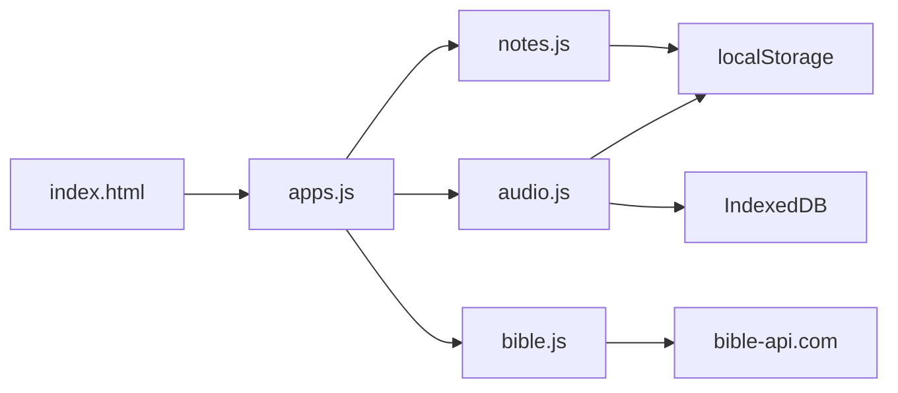
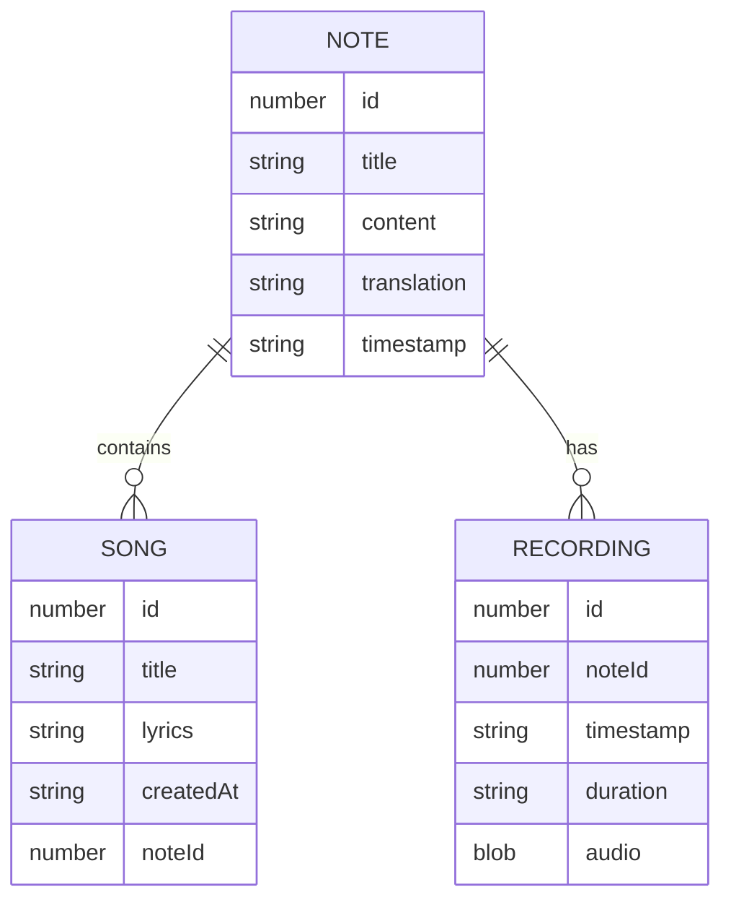

<p align="center">
  
</p>

<p align="center">
  <a href="#"></a>
  <a href="#"></a>
  <a href="#"></a>
  <a href="#"></a>
  <a href="#"></a>
</p>

<p align="center">
  Scripture Study Suite is a browser-based Bible study app with Bible reading, note-taking, verse context, per-note audio, and per-note songs/lyrics.
</p>

---

<p align="center">
  
</p>

## Quick Navigation

| Section | What You Get |
|---|---|
| [Features](#features) | Bible reader, notes, red-letter text, songs, recordings |
| [Architecture](#architecture) | App flow and storage diagrams |
| [Run Locally](#running-locally) | Local server setup |
| [PWA Setup](#pwa-setup) | Installable app configuration and testing |
| [Deploy](#deploying-to-github-pages) | GitHub Pages publish steps |
| [Troubleshooting](#troubleshooting) | Fast fixes for common issues |

## Features

### Bible Reading
- Select Bible **book**, **chapter**, and **translation**.
- Navigate chapters with previous/next controls.
- Search verse references (for example `John 3:16`) to jump directly.
- Click a verse to insert its reference into your notes.
- Red-letter style in Gospels: quoted speech in `Matthew`, `Mark`, `Luke`, `John` is highlighted in red.

### Notes
- Create, edit, autosave, and manually save notes.
- Sidebar list of saved notes for fast recall.
- Delete notes directly from the list.
- Verse references typed in notes are auto-detected and rendered in the context sidebar.

### Referenced Verses Sidebar
- Automatically fetches verse text for references found in notes.
- Shows reference cards and lets you jump/select in the note.
- Supports common abbreviations and verse ranges.

### Audio Recording (Per Note)
- Record audio in-browser using your microphone.
- Recordings are attached to the **current note**.
- Playback, download, and delete recordings in the UI.
- Persisted with IndexedDB so recordings survive page refreshes.

### Songs & Lyrics (Per Note)
- Add a song title and lyrics for the current study note.
- Persisted with the note.
- View/delete songs in a per-note list.
- Insert any saved song directly into note content.

## Architecture

### Application Flow



### Storage Model



## Tech Stack

- `index.html` - App layout and UI containers.
- `style.css` - Custom styling.
- `apps.js` - Main controller, chapter rendering, navigation, search.
- `bible.js` - Bible metadata, regex parsing, API calls.
- `notes.js` - Notes management, autosave, verse detection, songs UI/data.
- `audio.js` - Recorder, waveform visualizer, IndexedDB audio persistence.

## Data Storage

### localStorage
Used for lightweight structured data:
- `bibleStudyNotes` - notes array (title/content/references/translation/songs).
- `bibleStudyRecordings` - recording metadata backup.
- `bibleStudyUseFileSystem` - optional preference flag.

### IndexedDB
Used for binary audio data:
- Database: `BibleStudyDB`
- Object store: `recordings`
- Fields: `id`, `noteId`, `timestamp`, `duration`, `type`, `blob`

## Privacy & Permissions

- Microphone access is requested only when recording starts.
- Notes/audio/songs are stored in the browser on your machine.
- No app-owned backend is used for personal note/audio content.
- Bible text content is fetched from `https://bible-api.com`.

## Running Locally

Because microphone and some browser APIs are restricted on plain `file://`, run a local server.

### Option 1: VS Code Live Server
1. Open the project folder in VS Code.
2. Start Live Server.
3. Open the generated local URL.

### Option 2: Python HTTP server
```bash
python -m http.server 5500
```
Then visit `http://localhost:5500`.

## PWA Setup

The project is now configured to be PWA-eligible with:
- `manifest.webmanifest`
- `sw.js` service worker
- app icons in `icons/` (`192x192`, `512x512`, `apple-touch-icon`)
- manifest/meta links in `index.html`
- service worker registration in `apps.js`

### PWA Files

```text
manifest.webmanifest
sw.js
logo.png
icons/icon-32.png
icons/icon-192.png
icons/icon-512.png
icons/apple-touch-icon.png
```

### How To Verify PWA Eligibility

1. Serve the app over `https://` (or `http://localhost` for local testing).
2. Open DevTools -> **Application**:
   - Confirm manifest is detected.
   - Confirm `sw.js` is installed and activated.
3. Run Lighthouse (PWA category) and verify installability checks pass.
4. Test install:
   - Chrome/Edge desktop: use the install icon in the address bar.
   - Android Chrome: open menu -> **Install app**.
   - iOS Safari: Share -> **Add to Home Screen**.

### Updating The Service Worker Cache

When you change core files, update `CACHE_NAME` in `sw.js` (for example `scripture-study-suite-v2`) so clients receive a fresh cache.

## Deploying to GitHub Pages

1. Create a GitHub repo and push:
   - `index.html`
   - `style.css`
   - `apps.js`
   - `bible.js`
   - `notes.js`
   - `audio.js`
   - `manifest.webmanifest`
   - `sw.js`
   - `icons/`
2. In repo **Settings** -> **Pages**.
3. Set source to `Deploy from a branch`.
4. Choose `main` and `/root`.
5. Save and wait for publish.
6. Open your Pages URL.

## Browser Compatibility

- Best in Chromium-based browsers (Chrome/Edge/Brave).
- Safari support may vary for media/permissions.
- Private/incognito mode can block IndexedDB persistence.

## Known Limitations

- Red-letter rendering is an approximation (quoted speech in Gospels), not speaker-tagged source data.
- Recordings from the pre-IndexedDB version are not recoverable as playable blobs.
- If the external Bible API is unavailable, verse/chapter fetches fail until connectivity returns.

## Project Structure

```text
.
├─ index.html
├─ style.css
├─ apps.js
├─ bible.js
├─ notes.js
├─ audio.js
├─ manifest.webmanifest
├─ sw.js
└─ icons/
```

## Suggested Next Improvements

- Export/import full study bundles (notes + songs + audio).
- Add tags/topics for notes and songs.
- Add markdown preview mode.
- Add IndexedDB backup/restore tools.
- Add tests for verse parsing and persistence logic.

## Troubleshooting

### Microphone button does nothing
- Ensure site is served over `https://` (or `http://localhost`).
- Check browser microphone permissions.

### Recordings not showing after reload
- Confirm IndexedDB/storage is allowed.
- Avoid private/incognito mode for persistent storage.

### Verse fetch fails
- Check internet connection.
- Confirm `bible-api.com` is reachable.

## License

Add your preferred license (for example MIT).
