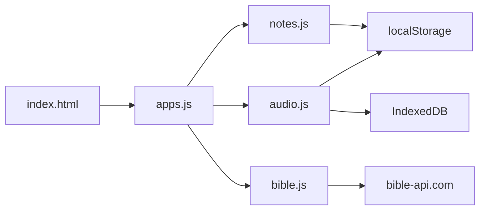
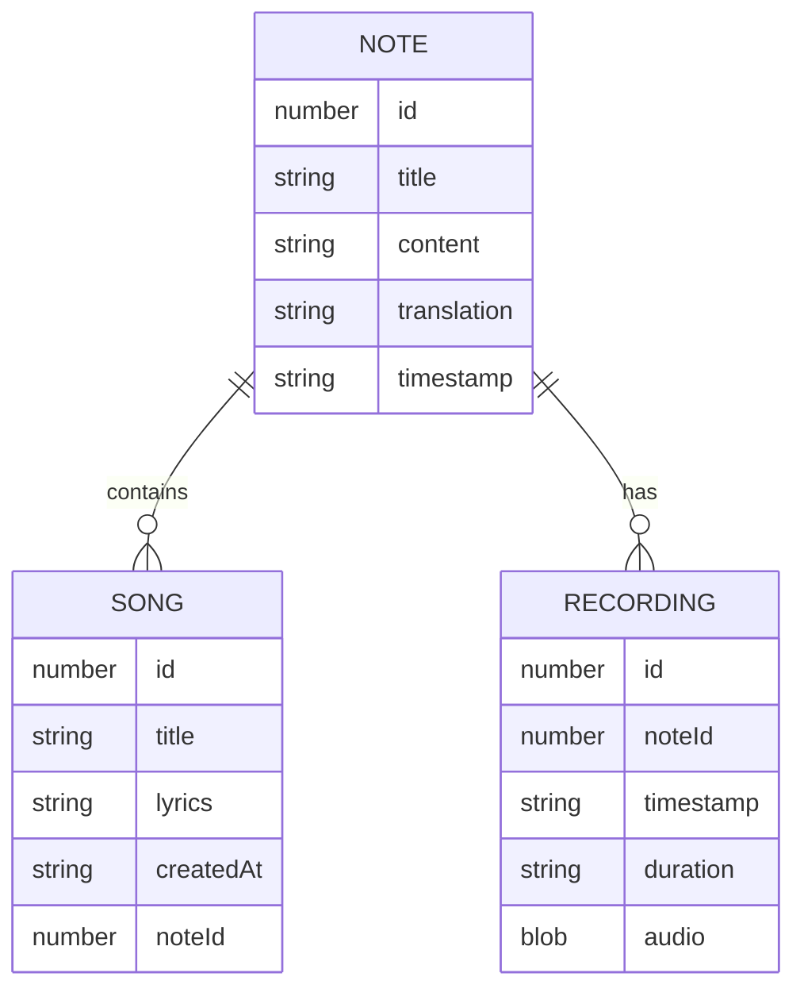

<p align="center">
  
</p>

<p align="center">
  <a href="#"></a>
  <a href="#"></a>
  <a href="#"></a>
  <a href="#"></a>
  <a href="#"></a>
</p>

<p align="center">
  Bible Study Suite is a browser-based Bible study app with Bible reading, note-taking, verse context, per-note audio, and per-note songs/lyrics.
</p>

---

## 🚀 Live Demo

[](https://jamesbrentlingeriv-spec.github.io/biblestudy/)

## Quick Navigation

| Section                              | What You Get                                            |
| ------------------------------------ | ------------------------------------------------------- |
| [Features](#features)                | Bible reader, notes, red-letter text, songs, recordings |
| [Architecture](#architecture)        | App flow and storage diagrams                           |
| [Run Locally](#running-locally)      | Local server setup                                      |
| [PWA Setup](#pwa-setup)              | Installable app configuration and testing               |
| [Deploy](#deploying-to-github-pages) | GitHub Pages publish steps                              |
| [Troubleshooting](#troubleshooting)  | Fast fixes for common issues                            |

## Features

### Bible Reading

- Select Bible **book**, **chapter**, and **translation**.
- Navigate chapters with previous/next controls.
- Search verse references (for example `John 3:16`) to jump directly.
- Click a verse to insert its reference into your notes.
- Red-letter style in Gospels: quoted speech in `Matthew`, `Mark`, `Luke`,
  `John` is highlighted in red.

### Notes

- Create, edit, autosave, and manually save notes.
- Sidebar list of saved notes for fast recall.
- Delete notes directly from the list.
- Verse references typed in notes are auto-detected and rendered in the context
  sidebar.

### Referenced Verses Sidebar

- Automatically fetches verse text for references found in notes.
- Shows reference cards and lets you jump/select in the note.
- Supports common abbreviations and verse ranges.

### Audio Recording (Per Note)

- Record audio in-browser using your microphone.
- Recordings are attached to the **current note**.
- Playback, download, and delete recordings in the UI.
- Persisted with IndexedDB so recordings survive page refreshes.

### Songs & Lyrics (Per Note)

- Add a song title and lyrics for the current study note.
- Persisted with the note.
- View/delete songs in a per-note list.
- Insert any saved song directly into note content.

## Left Bible Panel Usage

**Desktop**: Visible immediately after 3s splash screen. **Mobile**: Tap ☰ menu
(top-right) to slide panel in.

## Architecture

### Application Flow


```mermaid
flowchart LR
    A[index.html] --> B[apps.js]
    B --> C[notes.js]
    B --> D[audio.js]
    B --> E[bible.js]
    E --> F[bible-api.com]
    C --> G[localStorage]
    D --> H[IndexedDB]
    D --> G
```

### Storage Model


```mermaid
erDiagram
    NOTE ||--o{ SONG : contains
    NOTE ||--o{ RECORDING : has

    NOTE {
      number id
      string title
      string content
      string translation
      string timestamp
    }

    SONG {
      number id
      string title
      string lyrics
      string createdAt
      number noteId
    }

    RECORDING {
      number id
      number noteId
      string timestamp
      string duration
      blob audio
    }
```

## Tech Stack

- `index.html` - App layout and UI containers.
- `style.css` - Custom styling.
- `apps.js` - Main controller, chapter rendering, navigation, search.
- `bible.js` - Bible metadata, regex parsing, API calls.
- `notes.js` - Notes management, autosave, verse detection, songs UI/data.
- `audio.js` - Recorder, waveform visualizer, IndexedDB audio persistence.

## Data Storage

### localStorage

Used for lightweight structured data:

- `bibleStudyNotes` - notes array (title/content/references/translation/songs).
- `bibleStudyRecordings` - recording metadata backup.
- `bibleStudyUseFileSystem` - optional preference flag.

### IndexedDB

Used for binary audio data:

- Database: `BibleStudyDB`
- Object store: `recordings`
- Fields: `id`, `noteId`, `timestamp`, `duration`, `type`, `blob`

## Privacy & Permissions

- Microphone access is requested only when recording starts.
- Notes/audio/songs are stored in the browser on your machine.
- No app-owned backend is used for personal note/audio content.
- Bible text content is fetched from `https://bible-api.com`.

## Running Locally

**Local HTTP server required** (file:// blocks fetch API):

### VS Code Live Server (Recommended)

1. Install **Live Server** extension
2. Right-click `index.html` → **Open with Live Server**
3. `http://127.0.0.1:5500/` → John 3 KJV loads instantly

### Python

```bash
cd biblestudy
python -m http.server 8000
```

`http://localhost:8000`

## Deploying to GitHub Pages

1. Push to `main` branch
2. Settings → Pages → Source: `Deploy from branch` → `main` → `/ (root)`
3. Wait 5-10min → Live at `username.github.io/biblestudy`

## Browser Compatibility

- Chrome/Edge/Brave (best)
- Safari (media permissions may vary)
- Avoid private/incognito for IndexedDB

## Troubleshooting

| Issue                | Fix                                               |
| -------------------- | ------------------------------------------------- |
| Blank Bible panel    | Use HTTP server (Live Server), not file://        |
| No microphone        | Grant permission when prompted                    |
| Recordings disappear | Avoid incognito, refresh reloads IndexedDB        |
| GitHub Pages slow    | 5-10min deploy time, Ctrl+Shift+R to hard refresh |

## License

MIT License - Free to use/modify/distribute.
